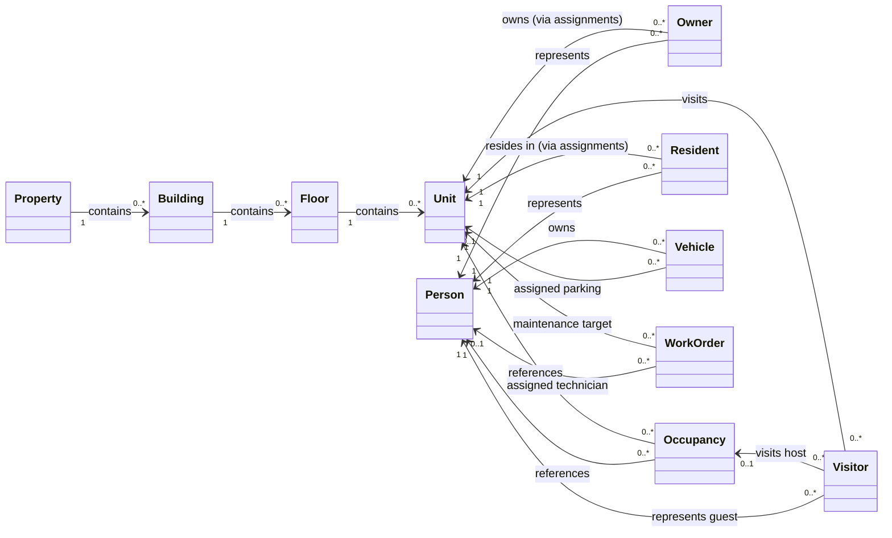

# IRM Enterprise — Domain Model

This document outlines the core business domain model of IRM Enterprise and the relationships between entities.

---

## 1. Domain Diagram

---

## 2. Domain Entity Relationships

### Property
- Represents the juristic estate or property development (e.g., condominium, apartment building, hotel).
- **Relationships**:
  - Contains zero or many **Buildings**.
  - Serves as the primary security boundary; all units and configurations are isolated by property.

### Building
- Represents a physical building block or tower inside a property.
- **Relationships**:
  - Belongs to exactly one **Property**.
  - Contains zero or many **Floors**.

### Floor
- Represents a level or story inside a building.
- **Relationships**:
  - Belongs to exactly one **Building**.
  - Contains zero or many **Units**.

### Unit
- Represents an individual condominium unit, apartment room, or business suite.
- **Relationships**:
  - Belongs to exactly one **Floor**.
  - Can have zero or many **Occupancies** (current tenants/residents).
  - Can have zero or many **Owners**.
  - Can receive zero or many **Visitors**.
  - Associated with zero or many **Work Orders**.

### Person
- The single source of truth representing any physical human being interacting with the system (e.g., owners, residents, employees, security guards, visitors).
- **Relationships**:
  - Associated with zero or one user **Profile** (for authentication).
  - Associated with zero or many **Occupancies**.
  - Associated with zero or many **Vehicles**.

### Owner
- Represents ownership rights and registry details for properties.
- **Relationships**:
  - Linked to a **Person** representing the owner.
  - Linked to one or many **Units** via owner assignments.

### Resident
- Represents an individual living in the property.
- **Relationships**:
  - Linked to a **Person** representing the resident.
  - Linked to one or many **Units** via resident assignments.

### Occupancy
- Represents the active contract, lease, or occupancy status (e.g., OWNER, CO_OWNER, TENANT, RESIDENT) of a person inside a specific unit.
- **Relationships**:
  - Binds one **Person** to one **Unit**.

### Visitor
- Represents an external guest checking in or out of the property.
- **Relationships**:
  - Linked to a **Person** representing the guest.
  - References a target **Unit** being visited.
  - References an optional host **Occupancy** record.
  - References a security officer (**Person**) who authorized the check-in.

### Vehicle
- Represents an automobile or motorcycle registered in the property's parking system.
- **Relationships**:
  - Owned by one **Person**.
  - Assigned to zero or one **Unit** for parking space tracking.

### Work Order
- Represents a maintenance request, facility repair, or task.
- **Relationships**:
  - Created for exactly one **Unit**.
  - Assigned to a technician (**Person**) to execute the work.
  - Managed/created by a property administrator (**Person**).
